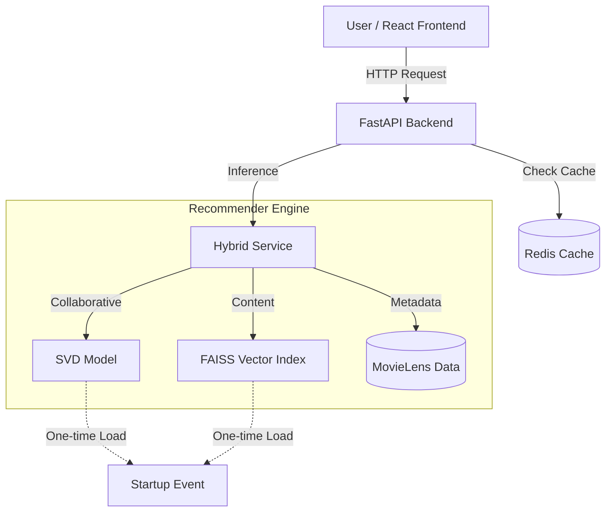

# AI-Powered Hybrid Movie Recommender

A professional-grade movie recommendation engine built with FastAPI and React. Uses a hybrid approach combining **Collaborative Filtering (SVD)** and **Content-Based Filtering (FAISS)**.

## Architecture

## Features

- **Blazing Fast**: Models are loaded into memory once on startup. Inference takes < 50ms.
- **Hybrid Recommendations**: Uses `surprise.SVD` for user history and `faiss` for vector similarity.
- **Netflix UI**: Modern React frontend with smooth animations, hero banner, and carousels.
- **Graceful Redis**: Integrated caching with automatic fallback if Redis is unavailable.
- **Memory Efficient**: Implements smart sampling for the 20M dataset.

## Setup & Run

### Backend

1. Install requirements: `pip install -r requirements.txt`
2. Run API: `uvicorn app.main:app --reload`
3. Visit `http://127.0.0.1:8000/docs`

### Frontend

1. Install: `cd frontend && npm install`
2. Run: `npm run dev`

## API Endpoints

- `/api/recommend/hybrid`: The main engine. Combine user_id and movie_title.
- `/api/movies/trending`: Surfaces high-popularity hits.
- `/api/movies/search`: Real-time autocomplete search.
